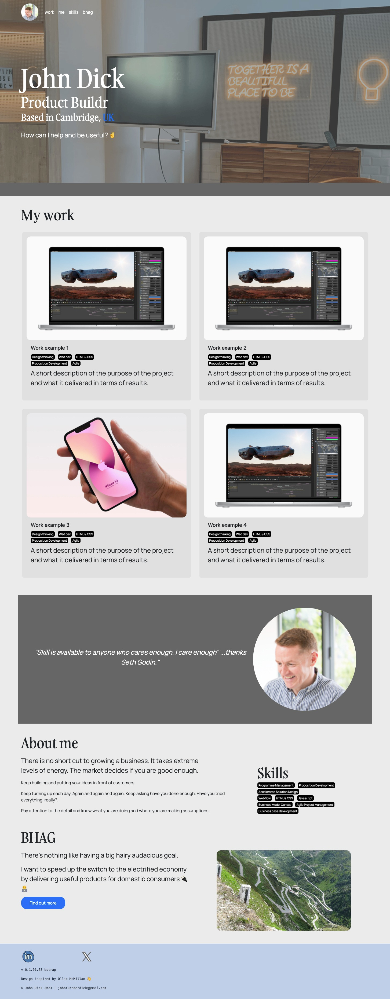

# Bootstrap-Portfolio - Week 3 assignment

Repository for EdX Week 3 Assignment | rebuild portfolio with Bootstrap.

This repository is where John Dick has stored all the inputs, files and outputs relating to the week 2 assignment - part of the EdX Front End bootcamp.

The HTML and CSS code is available to everyone under the standard MIT License.

The application creates this one portfolio landing page:

To note: The intent of this assignment was to re-build to include Bootstrap, not re-design. This is my re-build using Bootstrap.

What is the application?

The application creates a responsive practice portfolio site for John Dick. The objective of the site is to showcase examples of John's front-end coding skills. The intention is update and develop this site as the bootcamp progresses.

You can view the deployed application here:

https://johndck.github.io/Bootstrap-Portfolio/
